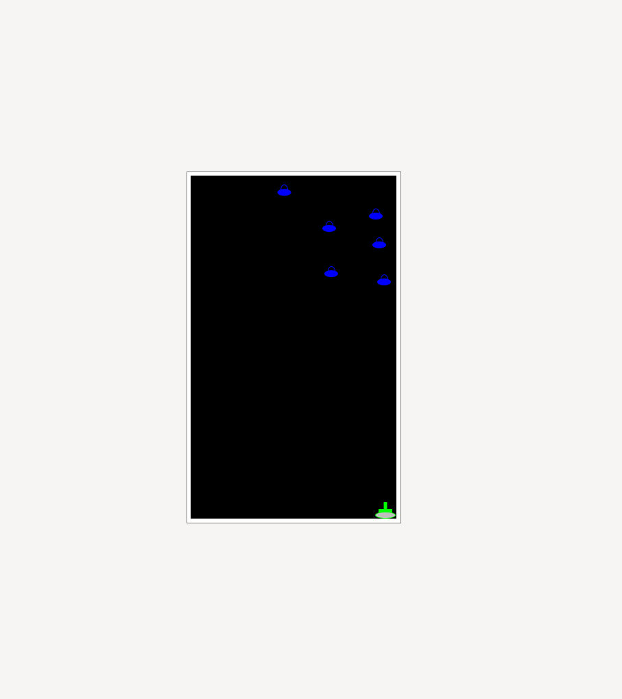

# aliens_vs_tanks
A small game made in racket, as the capstone of the [How to code simple data[(https://learning.edx.org/course/course-v1:UBCx+HtC1x+2T2017/home) course.

## Instructions
A simple game where the player takes the role of a tank, tasked with defending the earth from the dastardly alien's invasion. The player can move left and right and fire bullets directly up. Pressing R will reset the game. The aliens appear from the top of the screen and move on a 45 degree angle, either left or right. Game is over when an alien reaches the bottom of the screen.

Running the game requires the racket programming language to be installed on your machine. Clone the repo and navigate to it. Then, from the command line run:

```
racket aliens_vs_tanks.rkt
```


